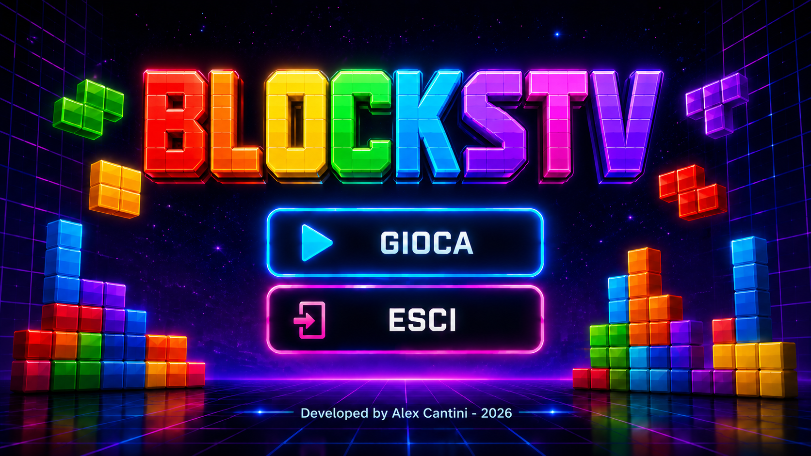

# BlocksTV v0.9

Puzzle a blocchi per **Android TV**, derivato dalla base stabile v0.8.
La v0.9 cambia solo branding e compatibilità dei controlli: il motore, i punteggi,
le rotazioni, le collisioni, i livelli e la curva di gravità restano identici.



## Novità della v0.9

- Nome app e progetto: **BlocksTV**; nome consigliato del repository: `BlocksTV`.
- Package / application ID: `com.alexcantini.blockstv`.
- Home, banner Android TV e logo durante la partita aggiornati al nuovo nome.
- Stile neon, layout, pulsanti GIOCA / ESCI e grafica della partita conservati.
- D-pad tramite tasti e assi HAT; stick analogico sinistro con zona morta e isteresi.
- Gestione dei controller riconosciuti dal dispositivo anche quando l'evento riporta un'altra sorgente.
- Fallback per modalità tastiera e pulsanti generici dei controller economici.
- Filtraggio dei duplicati D-pad tasti/assi e grilletti tasti/assi.
- Back standard segue lo stesso flusso di EXIT; il doppio evento TCL EXIT + Back viene filtrato per 500 ms.
- Perdita del focus, scollegamento o cambio modalità del controller: interrompono gli input e mette in pausa la partita attiva.
- Nessuna nuova schermata: i controlli restano descritti qui e nel pannello già esistente.

## Controlli

| Input | Durante la partita |
|---|---|
| ← / → (telecomando, D-pad, stick sinistro) | Movimento |
| ↓ | Caduta veloce finché premuto |
| ↑ | Una rotazione per pressione / inclinazione |
| OK / Enter / pressione centrale del D-pad | Nessuna azione |
| A / B / X / Y del gamepad | Rotazione, come nella v0.8 |
| Play/Pause, Play, Pause oppure Start | Pausa / riprendi |
| L2 digitale o analogico | Pausa / riprendi |
| EXIT TCL (4095), Back, Select oppure R2 | Flusso di uscita |

Nei menu: D-pad e stick selezionano; OK / Enter oppure A / B / X / Y confermano.
La conferma resta disponibile nel popup di uscita e dopo GAME OVER, come prima.
Back / EXIT annullano la scelta del livello; durante la partita aprono o chiudono
il popup. ANNULLA riprende la partita, anche se era già in pausa, come nella v0.8.

### Controller economici / multi-modalità

- Frecce Android standard e modalità tastiera **W / A / S / D**: stessi comandi direzionali.
- Escape: Back / EXIT.
- Pulsanti Android generici `BUTTON_1` / `2` / `3` / `4`: A / B / X / Y.
- L2: assi `LTRIGGER` o `BRAKE`; R2: `RTRIGGER` o `GAS`.
- Il D-pad HAT ha precedenza sullo stick; una diagonale verso il basso privilegia la caduta.
- Stick: attivazione oltre 0,55 e rilascio sotto 0,35, rispettando anche la zona morta dichiarata dal dispositivo.
- Il telecomando conserva il repeat nativo; sul controller il movimento laterale ripete dopo 250 ms, poi ogni 100 ms.
- Nei menu e per la rotazione occorre tornare al centro prima di una nuova azione.

Le modalità proprietarie che inviano codici diversi da questi richiedono una
verifica sul controller. Il supporto implementato non equivale a certificazione
su ogni modello: usare la [checklist di collaudo](docs/COMPATIBILITY_CHECKLIST.md).

## Base stabile e installazione

Conservare il pacchetto v0.8 separatamente. Non sovrascrivere la release stabile
finché non sono conclusi i test su TV e controller.

Il nuovo application ID permette di installare v0.8 e v0.9 affiancate.
Per il rollback basta riaprire la v0.8. Questo ZIP contiene un progetto locale
pronto per il repository `BlocksTV`; non rinomina un repository remoto su GitHub.

## Compilazione

- Android Studio e JDK 17 o compatibile
- Android SDK 35
- Android minimo API 23

Aprire la cartella del progetto in Android Studio, oppure:

```bash
./gradlew assembleDebug
```

Su Windows:

```bat
gradlew.bat assembleDebug
```

APK generato: `app/build/outputs/apk/debug/app-debug.apk`.
Versione `0.9`, version code `9`, compile / target SDK `35`.
L'APK debug è destinato al collaudo; una pubblicazione richiede la propria firma release.

## Modifiche e verifiche

Vedere [CHANGELOG](CHANGELOG.md), [rapporto di verifica](docs/VALIDATION.md)
e [note sugli asset](docs/ASSET_NOTES.md).

Gravità invariata per i livelli 1–10:
`600 / 515 / 445 / 380 / 330 / 285 / 245 / 210 / 180 / 155 ms`.

## Licenza

Il codice sorgente è distribuito con [licenza MIT](LICENSE).
